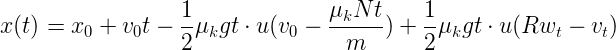
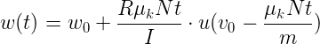
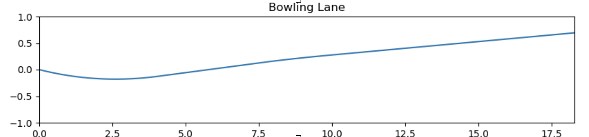

# Android Studio를 이용하여 Bowling Application 구현하기
2018 2학기 모바일앱프로그래밍 팀 프로젝트로 볼링 시뮬레이션 어플리케이션을 구현하기 위한 저장소입니다.  
크게 GUI구현 파트와 물리모델 구현 파트로 나뉘어집니다.

# Table of Contents  
- [1. GUI](#1-gui)
- [2. Model](#2-model)


## 1. GUI
------
Android Studio를 이용하여 아래 사진과 같이 Application의 GUI를 전반적으로 구현함.  
**Constraint Layout**을 이용하여 다양한 해상도에서도 깨짐 없이 지원할 수 있게 구현함.

  

## 2. Model
--------
#### Python을 이용하여 물리 모델을 구현 후 이를 Java로 다시 작성 함.



  
#### where ***u(t)*** is unit step function.  

첫 번째 식을 마찰과 구름을 고려하여 물리적으로 유도한 후, 변위를 구하기 위해 이를 적분하고, 볼링공의 시간에 따른 회전각 역시 마찬가지로 유도한다.  
이를 python 코드로 작성하였고, java로 변환하였다.  
공을 굴리는 각도도 마찬가지로 계산하여 좌표축을 회전변환하였다.  

현재 초기값으로 공의 초기 속도 및 방향 등을 임의로 입력하였는데,  
추후에 이를 스마트폰의 **가속도 센서, 자이로스코프 센서, 지자기 센서**   
이 3가지 센서를 이용하여 초기값들을 계산할 예정이다.

아래는 임의로 parameter 들을 지정하여 볼링공의 궤적을 계산한 예시이다. (python)
```python
# Parameters ...
mass = 7 # [kg]
radius = 0.1085 # [meter]
g = 9.8 # [m/s^2]
I = 2 / 5 * mass * radius * radius # inertia of sphere
u_k = 0.2 # friction coeff.
t = 0.01 # time slice = 0.01 [sec]

x_position = 0
y_position = 0

theta = 8 # throwing angle [degree]
angle = theta * math.pi / 180 # [rad]

# initial velocity, calculated by sensing values
x_vel = 6 # average...
y_vel = 0

# initial angular vel.
x_ang = 7
y_ang = 12
```

